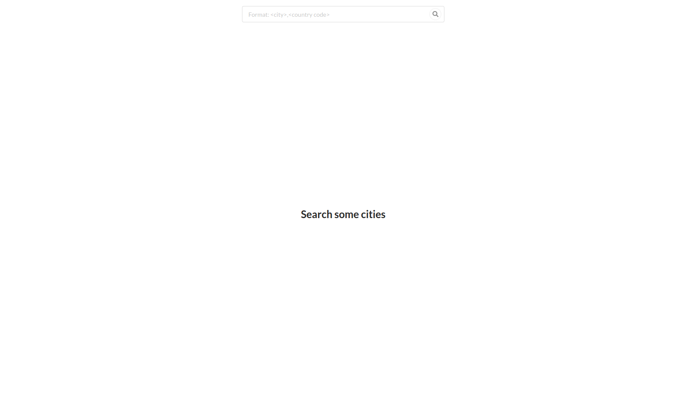
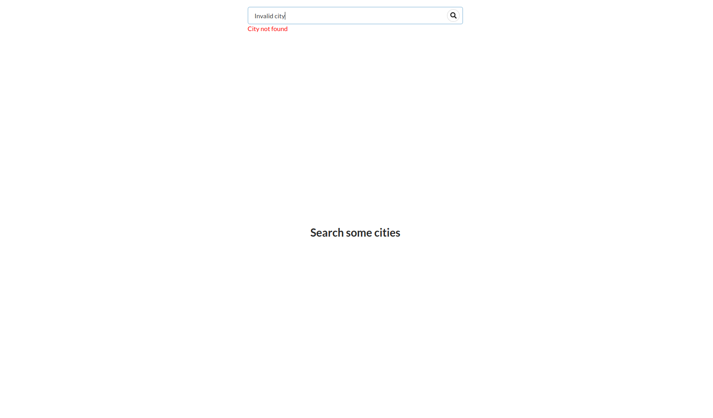
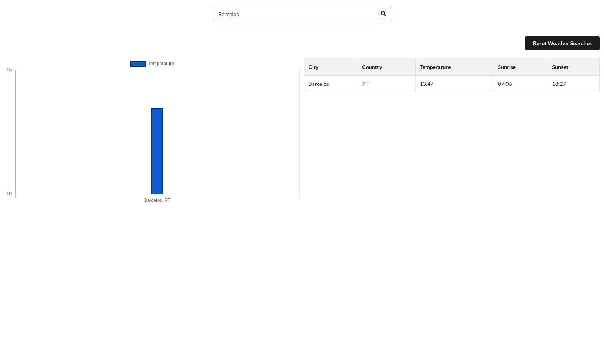
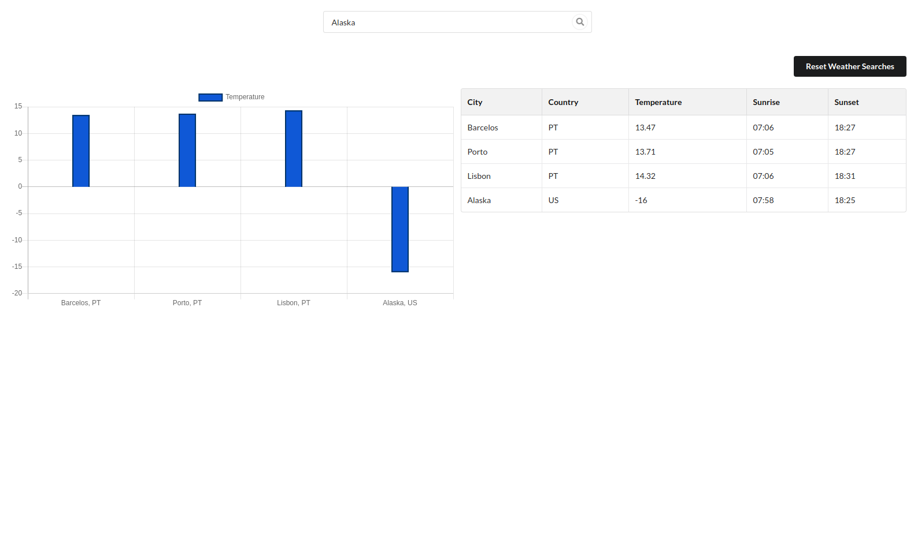

# city-weather

## Environment Variables

In order for the backend weather API server to properly function, an API key for the Open Weather Map must be provided: **OWM_API_KEY**. To set the variable with a value you can create a .env file in the root of the project in this format:

OWM_API_KEY=**your_api_key**

For the frontend side of the application, since it needs to connect to the backend weather API server, the **WEATHER_API_URL** environment variable is currently set to **http://localhost:4000** in the docker-compose.yaml file, but can be changed accordingly.

## How to start

To start the application, we run the docker-compose command:

    docker-compose up

To rebuild the images we run the following command:

    docker-compose build

We can then in the browser go to **http://localhost:5000** to access the frontend side of the application

## Application flow

The current layout of the application divides into the search bar on the top and the different views of the weather data fetched.

If we enter a location that is invalid, the API will return an error that will be displayed bellow the search bar

If we search for a valid location in the form of **city_name, country_code**, being the country code optional, then a Bar Chart along with a Table view of the data is displayed

Consequently, if we continue to search for more locations, they will be added to the two different views

Ultimately, we can reset the weather search list and reset the views, that brings us back to the initial screen.
The columns of the table are sortable.

## Backend

The backend server logs the requests made to it in a file **access.log**. It's available inside the docker container at **/log/server-logs/** and in the host file system at **/var/log/weather-api/**
